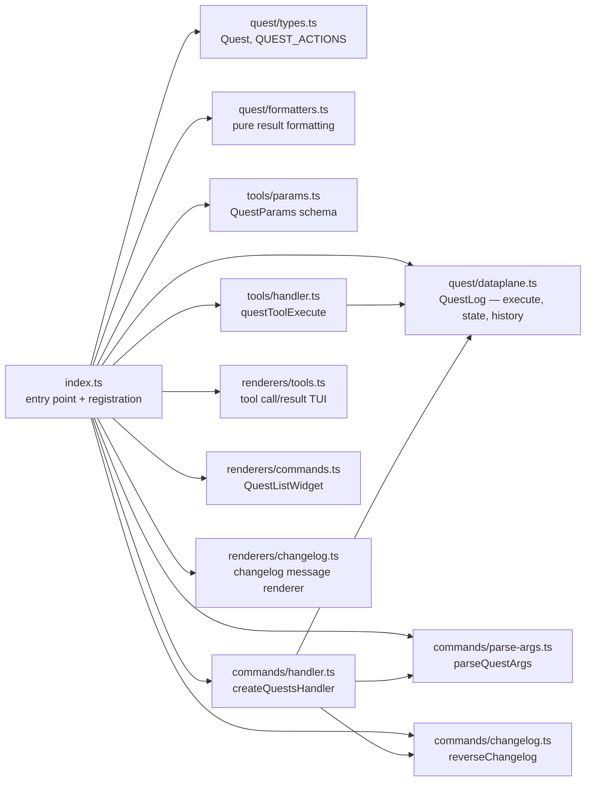
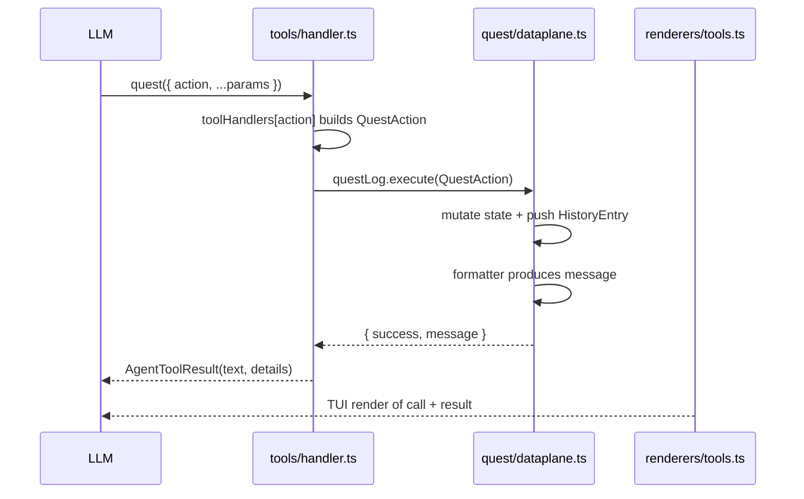
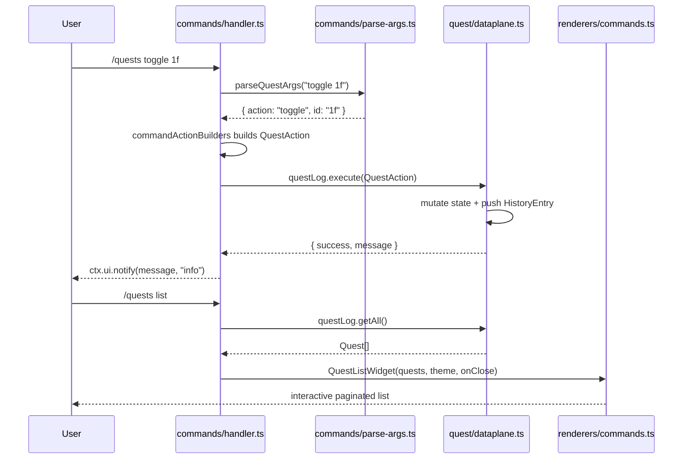
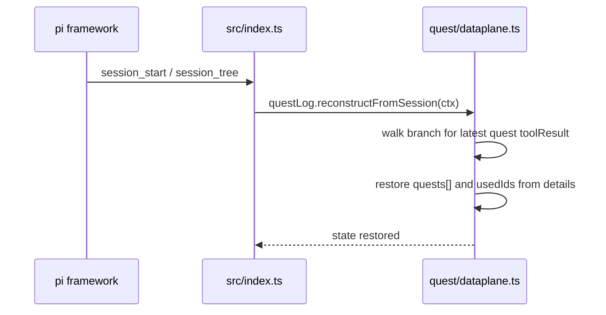

# Architecture

> See also: [Pattern](pattern.md) · [Reference](reference.md) · [Quests](quests.md)

## Overview

pi-quests is a [pi](https://github.com/mariozechner/pi-coding-agent) extension that adds a session-scoped quest log. It exposes one LLM-callable tool (`quest`) and one command namespace (`/quests`) that both operate on a shared in-memory `QuestLog` dataplane.

The extension loads via `pi install npm:pi-quests` (or `pi -e ./src/index.ts` for local development). On load it registers the tool, command, message renderer, session event hooks, and system prompt injection.

## Module map



| Module | Purpose |
|--------|---------|
| `src/index.ts` | Extension entry point — creates `QuestLog`, registers tools/commands/renderers, wires session hooks |
| `src/quest/types.ts` | `Quest`, `QUEST_ACTIONS`, `QUEST_ACTION_VALUES` — domain constants and types |
| `src/quest/formatters.ts` | Pure formatting functions for all quest results |
| `src/quest/dataplane.ts` | `QuestLog` — quest array, random hex IDs, history stack, `execute()`, revert, session reconstruction |
| `src/tools/params.ts` | `QuestParams` — Typebox schema for the `quest` tool |
| `src/tools/handler.ts` | `quest` tool implementation (`questToolExecute`, `registerQuestTool`) |
| `src/commands/parse-args.ts` | `/quests` argument tokenizer and parser |
| `src/commands/changelog.ts` | `reverseChangelog` helper for changelog display |
| `src/commands/handler.ts` | `/quests` command dispatcher |
| `src/renderers/tools.ts` | TUI renderers for tool calls and results |
| `src/renderers/commands.ts` | `QuestListWidget` — interactive paginated quest list |
| `src/renderers/changelog.ts` | Message renderer for `quest-changelog` messages |
| `src/logger.ts` | Namespaced debug logging |
| `src/version.ts` | Version and changelog path constants |

## Data flow

All mutations flow through the dataplane's `execute()` method. Adapters (tool and command handlers) only do three things:
1. Parse framework-specific input into a `QuestAction`
2. Call `questLog.execute(action)`
3. Adapt the result back to the framework (tool result, UI notification, or widget)

### Tool execution



The tool result always includes `details: { quests, usedIds }`. This lets the framework (and our session reconstruction logic) recover the full quest state from the session branch later.

### Command execution



Meta commands (`version`, `changelog`, `help`) and the `list` command short-circuit the dataplane because they do not mutate quest state.

### Session reconstruction



Because every tool result stores `details: { quests, usedIds }`, the entire `QuestLog` can be rebuilt by scanning the current session branch. No disk persistence is required, and quest state survives branch switches automatically.

## Key concepts

### The dataplane as the single source of truth

`QuestLog` lives in `src/quest/dataplane.ts` and is the **only** module that mutates quest state. All other layers adapt external input into a `QuestAction` and call `execute()`:

```typescript
export type QuestAction =
  | { type: "add"; descriptions?: string[] }
  | { type: "split"; id?: string; descriptions?: string[] }
  | { type: "list" }
  | { type: "toggle"; id?: string }
  | { type: "update"; id?: string; description?: string }
  | { type: "delete"; id?: string }
  | { type: "clear"; all?: boolean }
  | { type: "reorder"; id?: string; targetId?: string }
  | { type: "revert" };
```

This means:
- Tool handlers never call `questLog.add()` directly
- Command handlers never call `questLog.toggle()` directly
- Renderers and widgets are read-only

### History and revert

Every mutating action pushes a typed `HistoryEntry` onto a stack. Calling `revert` pops the most recent entry and restores the previous state:

| Action | History entry | Revert behavior |
|--------|---------------|-----------------|
| `add` | `{ type: "add", id }` | Removes the added quest; restores used ID |
| `split` | `{ type: "split", id, descriptions }` | Removes the added steps one by one (no custom history entry) |
| `toggle` | `{ type: "toggle", id }` | Flips the `done` flag back |
| `update` | `{ type: "update", id, previousDescription }` | Restores the previous description |
| `delete` | `{ type: "delete", quest, index, isStep?, cascadeDeletedSteps? }` | Reinserts the quest at its original index; restores cascade-deleted steps |
| `clear` | `{ type: "clear", previousQuests, previousSteps?, all }` or `{ quests, steps?, all }` | Restores the full quest array and used IDs |
| `reorder` | `{ type: "reorder", quest, oldIndex, previousIds, targetId }` | Restores the original order and IDs |

The revert logic is implemented as a typed `undoHandlers` map — one handler per `HistoryEntry` type — rather than an if-chain.

### Prompt injection

On `before_agent_start`, the extension prepends a high-salience `# Quest Management` gate to the system prompt (exploiting primacy bias), then appends a reminder block with active quests (exploiting recency). This creates an instruction sandwich that nudges the agent to track work as specific, actionable quests before any file reads or edits.

The `quest` tool registration also supplies `promptSnippet` and `promptGuidelines`, which the framework injects into the default system prompt when the tool is active.

## Design decisions

### Centralized formatting

All user-facing message strings live in `src/quest/formatters.ts`. They are pure functions with no framework dependencies. This makes them easy to test in isolation and ensures commands and tools present identical wording for the same operation.

### Adapter thinness

`src/tools/handler.ts` and `src/commands/handler.ts` are deliberately thin. They do not contain business logic; they only bridge the pi framework to the dataplane. This keeps the codebase maintainable as new features are added — future tools or commands will follow the same three-step adapter pattern.

### Session reconstruction without persistence

Because pi stores tool results in the session branch, we can rebuild `QuestLog` entirely from conversation history. This avoids file I/O for state storage and guarantees that branch switches always see the correct quest snapshot for that branch.
